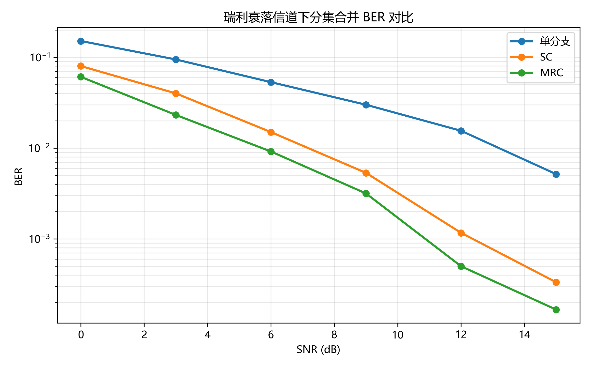
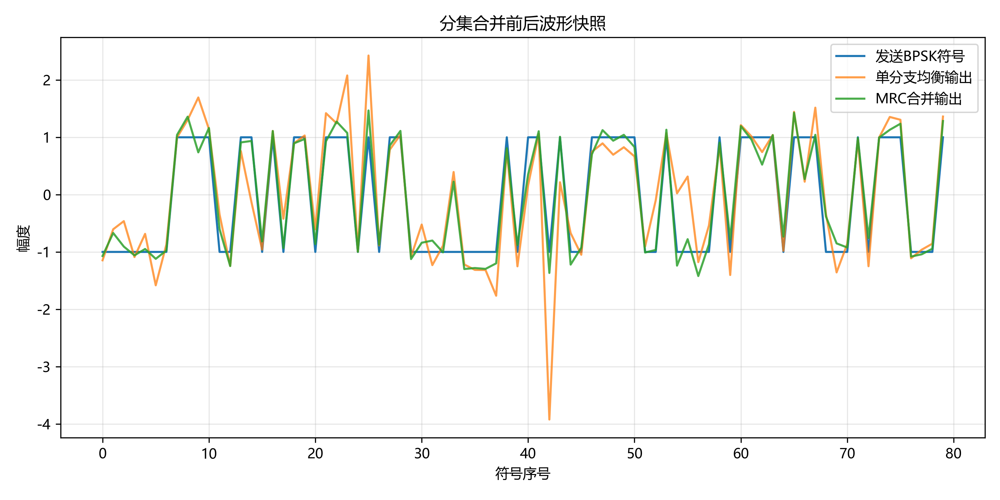
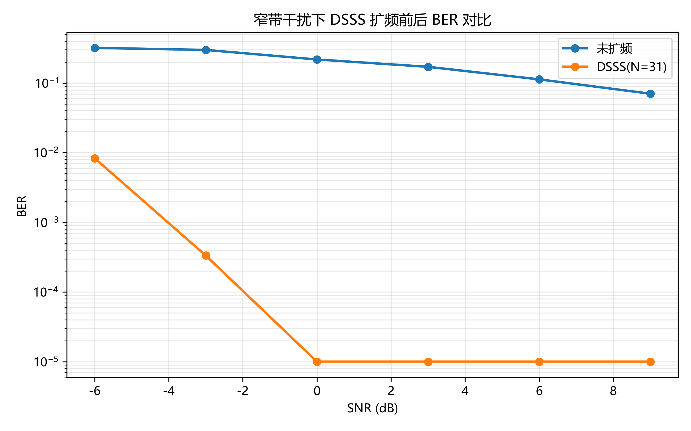
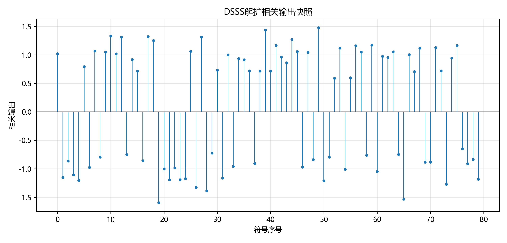

# 无线通信技术实验报告：分集与扩频通信

## 1. 实验目的

本实验围绕无线通信课程第 8 章“分集”和第 9 章“扩展频谱通信”展开，目标是通过代码仿真理解瑞利平坦衰落、分集合并和直接序列扩频通信的基本规律。具体目标包括：掌握 BPSK 信号在瑞利衰落信道中的接收与判决方法；实现选择合并 SC、最大比合并 MRC 和等增益合并 EGC；比较单分支、SC 和 MRC 在不同信噪比下的 BER 性能；实现 m 序列发生器、DSSS 扩频与相关解扩；计算处理增益，并观察窄带干扰条件下扩频通信相对未扩频通信的抗干扰优势。

## 2. 实验原理

### 2.1 分集合并

无线信道中的多径传播会使接收端收到多个幅度、相位和时延不同的信号分量。当这些分量随机叠加时，可能发生相长，也可能发生相消。若相消严重，等效信道幅度会突然变小，形成深衰落，导致瞬时接收信噪比急剧下降，误码率明显升高。本实验采用独立瑞利平坦衰落分支模拟这种现象，信道系数可表示为复高斯随机变量。

选择合并 SC 的思想是每个符号只选择瞬时信道增益最大的分支。若第 i 个分支接收信号为 \(r_i=h_i s+n_i\)，则 SC 按 \(|h_i|^2\) 选择最强分支，再用该分支信道系数进行均衡。SC 实现简单，但其他分支的信息被丢弃。

最大比合并 MRC 对所有分支进行共轭加权并归一化：

```text
s_hat = sum(conj(h_i) * r_i) / sum(|h_i|^2)
```

这种方法同时利用各分支能量，并使信道质量好的分支权重更高，因此在独立噪声条件下通常能获得最大的输出信噪比。选做的 EGC 只补偿各分支相位后等权合并，复杂度低于 MRC，性能通常介于 SC 和 MRC 附近。

### 2.2 扩频通信

直接序列扩频 DSSS 将每个信息比特映射为 BPSK 符号后，与高速 PN 码逐 chip 相乘，使信号能量扩展到更宽频带。接收端使用相同 PN 序列进行相关解扩，有用信号由于与 PN 序列完全相关而重新集中，非相关干扰则被扩展和平均。

本实验使用线性反馈移位寄存器生成 m 序列。寄存器每次输出最右端 bit，根据指定 taps 计算异或反馈并右移，最后将二进制输出映射为双极性 chip：bit 0 映射为 +1，bit 1 映射为 -1。扩频因子 N 等于 PN 序列长度，理想处理增益为：

```text
Gp(dB) = 10 log10(N)
```

当 N 增大时，每个信息符号由更多 chip 表示，相关解扩对窄带干扰的平均抑制能力增强。

## 3. 实验环境

- 操作系统：Windows 工作区环境
- Python 版本：3.13.7
- 主要依赖：NumPy 2.3.3、Matplotlib 3.10.6、pytest 9.0.3
- 核心脚本：`src/part1_diversity.py`、`src/part2_spread_spectrum.py`
- 自动评分脚本：`grading/calculate_grade.py`
- AI 助手使用情况：使用 AI 辅助理解函数接口、检查代码逻辑、生成报告初稿和润色表达；核心函数均按实验要求实现，并通过本地运行和评分脚本验证。

## 4. 实验方法与步骤

### 4.1 Part 1：分集合并

首先使用随机种子生成固定长度的 0/1 比特序列，并通过项目工具函数进行 BPSK 调制，映射关系为 0 -> +1，1 -> -1。随后为每个分支生成独立复高斯瑞利平坦衰落信道，使每个接收分支满足 \(r_i=h_i s+n_i\)。噪声采用复高斯 AWGN，噪声功率根据设定 SNR 自动计算。

在每个 SNR 点上，实验分别统计三种接收方式的 BER。单分支方式仅使用第一个分支并除以其信道系数完成均衡；SC 计算每个符号处各分支的 \(|h|^2\)，选择瞬时增益最大的分支输出；MRC 对所有分支执行信道共轭加权，并按总信道功率归一化。最后对均衡后的符号实部进行 BPSK 硬判决，并与发送比特比较得到 BER。

### 4.2 Part 2：DSSS 扩频通信

首先根据给定寄存器状态和 taps 生成 m 序列，若未指定长度，则默认周期为 \(2^m-1\)。本实验演示使用长度为 31 的 PN 序列，因此处理增益约为 14.91 dB。

扩频时，每个信息比特先映射为 BPSK 符号，再与整个 PN 序列相乘，输出 chip 序列长度为原比特数乘以扩频因子。信道中加入 AWGN 和固定频率的窄带余弦干扰。解扩时将接收 chip 按 PN 长度分块，每块与本地 PN 序列做相关，相关值非负判为 bit 0，相关值为负判为 bit 1。实验同时统计未扩频 BPSK 与 DSSS 系统在相同窄带干扰下的 BER 曲线。

## 5. 实验结果



图 5-1 分集 BER 曲线



图 5-2 分集合并波形快照



图 5-3 DSSS BER 曲线



图 5-4 DSSS 相关解扩输出

从图 5-1 可以观察到，随着 SNR 增大，三种接收方式的 BER 均整体下降；分集接收明显优于单分支接收，其中 MRC 曲线通常最低。图 5-2 展示了衰落信道下单分支均衡输出和 MRC 合并输出的对比，MRC 输出更接近原始 BPSK 符号。图 5-3 表明在窄带干扰存在时，DSSS 曲线优于未扩频系统。图 5-4 中相关输出围绕正负两侧分布，说明相关解扩能够为比特判决提供清晰依据。

## 6. 结果分析与讨论

1. 为什么瑞利衰落会造成深衰落？

瑞利衰落来自大量无直射分量的多径信号随机叠加。不同路径的相位随机变化，当多个分量在接收端相消时，等效信道幅度可能接近零。此时即使平均 SNR 不低，瞬时 SNR 也会显著下降，接收符号更容易被噪声扰动到错误判决区域。

2. SC 和 MRC 的合并思想有什么不同？

SC 是“只取最好分支”的方法，每个符号选择 \(|h|^2\) 最大的分支进行均衡。MRC 是“所有分支加权合并”的方法，它用信道共轭补偿相位，并按信道增益自然加权，最后用总信道功率归一化。

3. 为什么 MRC 通常优于 SC？

MRC 保留并利用所有分支中的有效能量，信道好的分支贡献更大，信道差的分支贡献较小，因此能最大化合并后的输出 SNR。SC 虽然避免了很差分支的影响，但丢弃了其他分支中仍然有用的信息，所以性能通常低于 MRC。

4. DSSS 的处理增益如何由扩频因子决定？

DSSS 的处理增益近似由扩频因子 N 决定，满足 `Gp(dB)=10log10(N)`。本实验 PN 长度为 31 时，处理增益约为 `10log10(31)=14.91 dB`。扩频因子越大，每个信息比特占用的 chip 数越多，相关解扩对非相关干扰的平均抑制越明显。

5. 窄带干扰经过解扩后为什么会被摊薄？

有用 DSSS 信号在发送端乘 PN 序列，接收端再乘同一 PN 序列后会相关集中；而窄带干扰没有与 PN 序列同步，也不具备相同相关性。解扩操作等效于把窄带干扰乘上高速伪随机序列，使其能量分散到较宽频带，并在每个符号相关求和时相互抵消一部分，所以等效干扰功率下降。

6. 本实验中 BER 曲线是否符合理论预期？

实验结果符合理论预期。分集部分中，SNR 增大时 BER 下降，分集接收优于单分支，MRC 通常优于 SC，说明多分支接收能够降低深衰落造成的误码风险。DSSS 部分中，扩频系统在窄带干扰下的 BER 低于未扩频系统，说明相关解扩和处理增益有效提高了抗干扰能力。

## 7. 实验心得

通过本实验可以直观看到无线信道的“平均条件”和“瞬时条件”并不等价。瑞利信道下即使平均 SNR 较高，也可能因为深衰落出现较大误码；分集技术的价值正在于降低多个分支同时深衰落的概率。SC 实现简单，MRC 性能更优，这体现了复杂度与性能之间的取舍。

DSSS 实验进一步说明，扩频并不是简单增加发送能量，而是通过 PN 序列改变信号和干扰在频域及相关域中的表现。有用信号能够被本地 PN 序列重新聚集，而窄带干扰在解扩后被分散。自动评分脚本也帮助我及时发现代码接口、图像生成和报告完整性问题，使实验过程更接近工程中的“实现、验证、修正”闭环。

## 8. 参考资料

- 课程课件：第 8 章 分集
- 课程课件：第 9 章 扩展频谱通信
- `docs/theory_diversity.md`
- `docs/theory_spread_spectrum.md`
- 本实验仓库 `README.md`、`PROJECT_README.md` 与自动评分脚本
